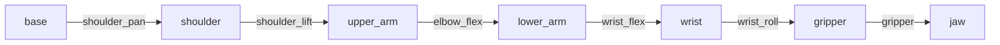
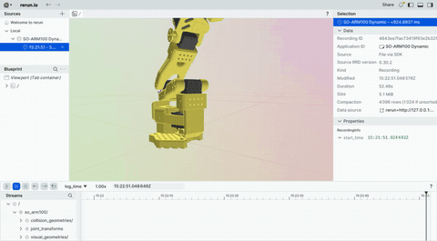

# SO-ARM100 机械臂 URDF 分析与仿真


---

## 📋 目录

- [项目概述](#-项目概述)
- [URDF 文件概览](#-urdf-文件概览)
- [关节分析](#-关节-joint-分析)
- [连杆分析](#-连杆-link-分析)
- [运动学链结构](#-运动学链结构)
- [实践修改](#-实践修改关节参数)
- [运动学验证](#-运动学验证)
- [动态仿真](#-动态仿真)
- [Gazebo 仿真支持](#-gazebo-仿真支持)
- [问题与解决](#⚠️-遇到的问题与解决)
- [项目总结](#-项目总结)

---

## 🎯 项目概述

本项目旨在深入学习机器人 URDF（Unified Robot Description Format）的核心结构，理解关节、连杆、运动学参数的表示方法，并实现从结构分析到物理仿真的完整流程。

### 项目内容

| 模块 | 内容 | 工具 |
|------|------|------|
| URDF 分析 | 解析关节、连杆、运动学链 | yourdfpy |
| 模型修改 | 添加虚拟连杆、修改参数 | XML 编辑 |
| 运动学验证 | 正运动学计算与验证 | Python |
| 动态仿真 | 关节正弦运动可视化 | Rerun |
| 物理仿真 | Gazebo 动力学仿真 | ROS + Gazebo |

### URDF 来源

[TheRobotStudio/SO-ARM100](https://github.com/TheRobotStudio/SO-ARM100) 仓库中的 `urdf/so100.urdf`

---

## 📁 URDF 文件概览

| 属性 | 值 |
|------|-----|
| 文件名 | `so100.urdf` |
| 文件大小 | 9 KB |
| 连杆数量 | 7 个 |
| 关节数量 | 6 个（全部为旋转关节） |
| 依赖资源 | `assets/` 文件夹下的 STL 模型文件 |

> 💡 **注意**：学习时缺失 mesh 文件不影响结构分析，但完整可视化需要下载 `assets/` 文件夹。

---

## 🔩 关节 (Joint) 分析

### Python 加载代码

```python
from yourdfpy import URDF

robot = URDF.load("so100.urdf")
for joint in robot.robot.joints:
    print(joint.name, joint.type)
```

### 关节列表

| 序号 | 关节名称 | 类型 | 作用 |
|:----:|----------|------|------|
| 1 | `shoulder_pan` | revolute | 腰部旋转 |
| 2 | `shoulder_lift` | revolute | 肩部俯仰 |
| 3 | `elbow_flex` | revolute | 肘部弯曲 |
| 4 | `wrist_flex` | revolute | 腕部俯仰 |
| 5 | `wrist_roll` | revolute | 腕部旋转 |
| 6 | `gripper` | revolute | 夹爪开合 |

### 关键关节详细参数

| 关节名称 | 类型 | 轴方向 (xyz) | 运动范围 (rad) | 最大力矩 (Nm) | 作用 |
|----------|------|--------------|----------------|---------------|------|
| `shoulder_pan` | revolute | (0, 1, 0) | [-2.0, 2.0] | 35 | 腰部旋转 |
| `shoulder_lift` | revolute | (1, 0, 0) | [0, 3.5] | 35 | 肩部俯仰 |
| `elbow_flex` | revolute | (1, 0, 0) | [-π, 0] | 35 | 肘部弯曲 |
| `wrist_flex` | revolute | (1, 0, 0) | [-2.5, 1.2] | 35 | 腕部俯仰 |
| `wrist_roll` | revolute | (0, 1, 0) | [-π, π] | 35 | 腕部旋转 |
| `gripper` | revolute | (0, 0, 1) | [-0.2, 2.0] | 35 | 夹爪开合 |

---

## 🔗 连杆 (Link) 分析

### 连杆列表

| 连杆名称 | 视觉几何 | 碰撞几何 | 质量 (kg) |
|----------|----------|----------|-----------|
| `base` | `Base.stl` | `Base.stl` | 1.000 |
| `shoulder` | `Rotation_Pitch.stl` | `Rotation_Pitch.stl` | 0.119 |
| `upper_arm` | `Upper_Arm.stl` | `Upper_Arm.stl` | 0.162 |
| `lower_arm` | `Lower_Arm.stl` | `Lower_Arm.stl` | 0.148 |
| `wrist` | `Wrist_Pitch_Roll.stl` | `Wrist_Pitch_Roll.stl` | 0.066 |
| `gripper` | `Fixed_Jaw.stl` | `Fixed_Jaw.stl` | 0.093 |
| `jaw` | `Moving_Jaw.stl` | `Moving_Jaw.stl` | 0.020 |

### 补充说明

- **缺失 mesh 文件的影响**：未下载 `assets/` 文件夹时，Python 加载会出现 `Unable to resolve filename` 警告，但关节信息依然完整
- **可视化需求**：如需完整可视化，可下载整个仓库并保持相对路径一致

---

## 🦾 运动学链结构

机械臂的运动学链（从基座到末端）：

```
base ──[shoulder_pan]──> shoulder ──[shoulder_lift]──> upper_arm
                                                          │
                            [elbow_flex]                  │
                                                          ▼
jaw <──[gripper]── gripper <──[wrist_roll]── wrist <──[wrist_flex]── lower_arm
```

### Mermaid 可视化



---

## ✏️ 实践修改关节参数

### 1️⃣ 修改关节限位

- **目的**：验证 URDF 中关节限位对运动范围的影响
- **操作**：将 `shoulder_pan` 关节的 `upper` 限位从 `2.0 rad` 改为 `1.0 rad`
- **验证代码**：
  ```python
  joint = [j for j in robot.robot.joints if j.name == 'shoulder_pan'][0]
  print(joint.limit.upper)  # 输出 1.0
  ```
- **结果**：✅ 成功修改
- **延伸思考**：如果限位设置过小，会导致机械臂无法到达某些工作空间位置

### 🎨 2️⃣ 修改连杆颜色

- **目的**：理解 URDF 中视觉材质的定义方式
- **操作**：将 `base_link` 的 `<color rgba="0.7 0.7 0.7 1.0"/>` 修改为 `"1.0 0.0 0.0 1.0"`（红色）
- **验证**：通过 Python 读取确认属性变化
- **收获**：掌握了 URDF 中视觉材质的定义与修改方法

### 3️⃣ 添加虚拟连杆

- **操作**：在 URDF 中增加红色球体连杆 `marker_link`，通过固定关节固定在 `base` 上
- **验证**：使用 Python 加载新 URDF，确认连杆和关节均成功添加
- **意义**：掌握了扩展 URDF 模型的方法，为后续自定义机器人模型打下基础

> 💡 **注意事项**：
> - **XML 语法**：修改 URDF 时确保标签正确闭合，避免出现未配对标签
> - **路径管理**：若修改后的 URDF 与原始文件在同一目录，加载时直接使用文件名；若移动位置，需使用绝对路径
> - **惯性参数**：添加的虚拟连杆虽不影响运动学，但建议设置合理的惯性值（如质量极小），避免动力学仿真报错

---

## 📐 运动学验证

### 正运动学验证脚本

使用 `yourdfpy` 编写脚本 `fk_test.py`，给定关节角度，计算末端执行器（`gripper`）相对于基座（`base`）的位置和姿态。

#### 测试 1：零位姿态（所有关节角度=0）

| 参数 | 值 |
|------|-----|
| **位置** | `(0.1775, 0.0925, -0.0000)` m |
| **旋转矩阵** | `[[0, 0.335, -0.942], [0, 0.942, 0.335], [1, 0, 0]]` |

> 该矩阵描述了末端坐标系在基座坐标系下的方向。第三列 `(-0.942, 0.335, 0)` 近似为 Z 轴方向，与机械臂水平伸展时的姿态预期一致。

#### 测试 2：非零姿态（shoulder_lift=0.5 rad）

| 参数 | 值 |
|------|-----|
| **位置** | `(0.1758, 0.0227, -0.0000)` m |
| **旋转矩阵** | `[[0, 0.746, -0.666], [0, 0.666, 0.746], [1, 0, 0]]` |

> 当肩关节抬起 0.5 rad 时，末端 Y 坐标从 0.0925m 减小到 0.0227m（手臂向上抬起），末端 Z 轴方向从零位时的 `(-0.942, 0.335, 0)` 变为 `(-0.666, 0.746, 0)`，反映了末端指向的变化。

#### 结论

✅ 末端位姿随关节角度变化符合运动学规律，验证了 URDF 模型的正确性。该脚本可为后续轨迹规划提供基础。

> 💡 **注意事项**：
> - **末端连杆名称**：不同 URDF 中末端执行器连杆名可能不同（如 `gripper_link`、`end_effector_link`）。使用前可先打印所有连杆名：`[link.name for link in robot.robot.links]`
> - **关节顺序**：`link_fk()` 需要关节角度字典，键名必须与 URDF 中的关节名完全一致（包括大小写）
> - **坐标参考系**：`link_fk()` 返回的变换矩阵是相对于世界坐标系的，若需要相对于基座坐标系，可额外计算

---

## 🎬 动态仿真

### 连续运动仿真

- **脚本**：`leRobot_sim.py`
- **功能**：通过正弦信号驱动各关节，实时计算并打印末端位置轨迹
- **结果**：末端位置随时间周期性变化，验证了关节空间到笛卡尔空间的映射
- **意义**：为后续轨迹规划与控制提供了基础示例

### Rerun 可视化仿真

- **脚本**：`rerun_demo.py`
- **功能**：使用 Rerun Viewer 实时可视化机械臂的正弦运动
- **演示**：



#### 安装 Rerun

```bash
conda activate lerobot
pip install rerun-sdk
rerun --version
```

#### 运行仿真

**方式一：自动启动（推荐）**

直接运行脚本，Rerun 会自动打开一个窗口：

```bash
python rerun_demo.py
```

第一次运行时可能会弹出匿名数据收集提示，按提示选择即可。稍等片刻，Rerun Viewer 窗口将显示机械臂模型，并且各关节开始做正弦运动。

**方式二：手动启动（如果自动启动失败）**

1. 打开一个新的终端，激活环境，输入 `rerun` 并回车，保持该终端和 Viewer 窗口打开
2. 修改 `rerun_demo.py`：注释 `rr.init(..., spawn=True)`，取消 `rr.connect_grpc()` 的注释
3. 在原来的终端中再次运行 `python rerun_demo.py`，脚本将连接到已打开的 Viewer

> 💡 **提示**：在终端按 `Ctrl+C` 可安全停止循环。

---

## 🤖 Gazebo 仿真支持

本项目已添加完整的 Gazebo 仿真支持，包括 URDF 扩展、launch 文件和配置文件。

### 📁 文件结构

```
so100_urdf/
├── urdf/
│   ├── so100.urdf              # 原始 URDF 文件
│   └── so100_gazebo.urdf       # 添加 Gazebo 支持的 URDF
├── launch/
│   ├── gazebo.launch           # Gazebo 启动文件
│   └── rviz.launch             # RViz 启动文件
├── rviz/
│   └── robot.rviz              # RViz 配置文件
├── worlds/
│   └── empty.world             # 空世界文件
├── assets/                     # STL 模型文件
├── package.xml                 # ROS 包描述文件
└── CMakeLists.txt              # CMake 构建文件
```

### 🔧 Gazebo URDF 主要改动

`so100_gazebo.urdf` 相比原始文件增加了以下内容：

| 改动项 | 说明 | 示例值 |
|--------|------|--------|
| Gazebo 材料标签 | 为每个连杆指定 Gazebo 中的颜色 | `Gazebo/Yellow` |
| 摩擦系数 | 为每个连杆添加摩擦参数 | `mu1=mu2=0.5` |
| 关节动力学 | 为每个关节添加阻尼和摩擦 | `damping=0.1, friction=0.1` |
| Gazebo 控制插件 | 添加 ROS 控制插件 | `gazebo_ros_control` |
| 碰撞几何 | 为所有连杆添加碰撞模型 | 同视觉几何 |
| 硬件接口 | 更改 transmission 接口类型 | `EffortJointInterface` |

### 🚀 启动命令

#### 前置要求

1. 安装 ROS（推荐 ROS Noetic for Ubuntu 20.04）
2. 安装 Gazebo 相关包：
   ```bash
   sudo apt-get install ros-noetic-gazebo-ros ros-noetic-gazebo-ros-control ros-noetic-gazebo-plugins
   ```

#### 安装步骤

```bash
# 1. 将包复制到 catkin 工作空间
mkdir -p ~/catkin_ws/src
cp -r so100_urdf ~/catkin_ws/src/
cd ~/catkin_ws

# 2. 编译工作空间
catkin_make
source devel/setup.bash

# 3. 启动 Gazebo 仿真
roslaunch so100_urdf gazebo.launch

# 4. 启动 RViz 可视化（可选）
roslaunch so100_urdf rviz.launch
```

#### 启动参数

`gazebo.launch` 支持以下参数：

| 参数 | 默认值 | 说明 |
|------|--------|------|
| `paused` | false | 启动时是否暂停仿真 |
| `use_sim_time` | true | 是否使用仿真时间 |
| `gui` | true | 是否显示 Gazebo GUI |
| `headless` | false | 是否无头模式运行 |
| `debug` | false | 是否启用调试模式 |
| `world_name` | empty.world | 世界文件路径 |

**示例**：启动暂停的仿真
```bash
roslaunch so100_urdf gazebo.launch paused:=true
```

### 🎮 控制机械臂

启动仿真后，可以使用 GUI 手动控制关节：

```bash
# 方式 1：使用 joint_state_publisher_gui
rosrun joint_state_publisher_gui joint_state_publisher_gui

# 方式 2：使用 ROS 话题发布关节命令
rostopic pub /so_arm100/joint_states sensor_msgs/JointState "{header: {stamp: now}, name: ['shoulder_pan'], position: [1.0]}"
```

### ⚠️ 注意事项

1. **mesh 文件路径**：Gazebo URDF 中使用 `package://so100_urdf/assets/` 路径，确保包正确安装在 catkin 工作空间中
2. **ROS 版本兼容**：本项目基于 ROS Noetic 测试，其他版本可能需要调整
3. **仿真性能**：如遇到仿真速度慢，可尝试降低 `real_time_update_rate` 参数

---

## ⚠️ 遇到的问题与解决

| 问题 | 解决方案 |
|------|----------|
| **conda 安装环境时报 TOS 错误** | 执行 `conda tos accept` 命令接受服务条款，或使用 `--no-deps` 跳过依赖安装 |
| **conda 求解器 libmamba 加载失败** | 切换为 classic 求解器：`conda config --set solver classic`。若 conda 已损坏，直接重装 Miniconda |
| **克隆 LeRobot 仓库超时/失败** | 改用 ZIP 下载，或使用 Gitee 镜像导入 |
| **URDF 加载时提示缺少 STL 文件** | 该警告不影响关节结构分析，忽略即可；如需完整可视化可补充下载 `assets` 文件夹 |
| **Python 中打印关节轴信息时报错** | `joint.axis` 是 NumPy 数组，不能直接做布尔判断，应使用 `if joint.axis is not None`；获取轴分量时用 `joint.axis[0]` 而非 `.xyz` |
| **添加虚拟连杆后 Rerun 无法加载 URDF** | 固定关节的父连杆名称错误（`base_link` 应为 `base`），修正后成功 |
| **Rerun 动态脚本报 `rr.flush()` 不存在** | Rerun 新版本已自动刷新，移除 `rr.flush()` 即可 |
| **`rr.urdf.UrdfTree` 不存在** | 升级 Rerun 到 0.28+：`pip install --upgrade rerun-sdk` |
| **动态仿真时 Viewer 无法自动启动** | 采用手动启动方式：先运行 `rerun` 打开 Viewer，再运行脚本并改为 `rr.connect_grpc()` |

---

## 📌 项目总结

通过本项目，完成了以下工作：

### 完成内容

| 序号 | 内容 | 成果 |
|:----:|------|------|
| 1 | **环境搭建** | 从零配置 conda 环境，安装 LeRobot、yourdfpy、Rerun 等工具链 |
| 2 | **URDF 结构分析** | 提取 6 个旋转关节参数、7 个连杆运动学链关系 |
| 3 | **模型扩展** | 为基座添加虚拟红色小球连杆 |
| 4 | **运动学验证** | 编写正运动学脚本，验证不同关节角度下末端位姿 |
| 5 | **动态仿真** | 基于 Rerun 实现关节正弦运动可视化 |
| 6 | **Gazebo 仿真** | 添加完整的 Gazebo 物理仿真支持 |
| 7 | **版本控制** | 将全部代码、文档托管至 GitHub |

### 核心收获

- ✅ 掌握了机器人 URDF 模型的核心语法及解析方法
- ✅ 学会了使用 Python 进行运动学计算与仿真
- ✅ 熟悉了 Rerun 等现代可视化工具的使用
- ✅ 掌握了 Gazebo 物理仿真的配置方法
- ✅ 提升了工程化能力（环境配置、问题排查、文档撰写、Git 管理）

---

## 🚀 后续计划

| 计划 | 状态 | 说明 |
|------|------|------|
| ~~Gazebo 仿真~~ | ✅ 已完成 | 将 URDF 导入 Gazebo 物理引擎，添加控制插件 |
| 轨迹规划 | 🔄 待完成 | 编写末端直线或圆弧插值算法 |
| ROS 集成 | 🔄 待完成 | 将 URDF 转换为 ROS 包，利用 MoveIt 进行运动规划 |
| LeRobot 数据集加载 | 🔄 待完成 | 尝试加载 SO-100 的真实数据集 |
| 动力学参数优化 | 🔄 待完成 | 完善惯性、碰撞模型 |

---

## 🔗 相关资源

- [Gazebo 官方文档](http://gazebosim.org/)
- [ROS Gazebo ROS 包](http://wiki.ros.org/gazebo_ros)
- [URDF 规范](http://wiki.ros.org/urdf)
- [yourdfpy 文档](https://github.com/clemense/yourdfpy)
- [Rerun 文档](https://www.rerun.io/docs)

---

<p align="center">Made with ❤️ for Robotics Learning</p>