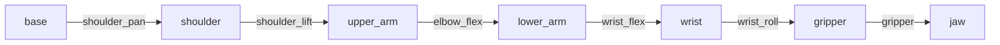

         
# SO-ARM100 机械臂 URDF 结构分析

## 项目概述

- **目标**：学习机器人 URDF（统一机器人描述格式）的核心结构，理解关节、连杆、运动学参数的表示方法。
- **URDF 来源**：[TheRobotStudio/SO-ARM100](https://github.com/TheRobotStudio/SO-ARM100) 仓库中的 urdf/so100.urdf
- **使用工具**：
    - Python + yourdfpy 加载并解析 URDF
    - Foxglove Studio（可选）进行可视化
    - VS Code 编辑 XML 文件

## 一、URDF 文件概览

- **文件名**：so100.urdf
- **文件大小**：9 KB
- **主要内容**：定义了 7个连杆、6 个关节（全部为旋转关节，无固定关节）
- **依赖资源**：引用了 assets/ 文件夹下的 STL 模型文件（如 Base.stl 等），但学习时缺失不影响结构分析

## 二、关节（Joint）分析

使用 Python 加载并打印所有关节信息：

python

from  
robot = URDF.load("so100.urdf")  
for joint in robot.robot.joints:  
print(joint.name, joint.type)

### 输出结果（实际运行结果粘贴在这里）：

text

shoulder_pan		revolute
shoulder_lift		revolute
elbow_flex		revolute
wrist_flex		revolute
wrist_roll		revolute
gripper		revolute
### 关键关节详细记录（至少 3 个）

| 关节名称 | 类型  | 轴方向 (xyz) | 运动范围 (lower, upper) | 作用  |
| --- | --- | --- | --- | --- |
| shoulder_pan | revolute | (0, 1, 0) | (-2, 2) rad | 腰部旋转 |
| shoulder_lift | revolute | (1, 0, 0) | (0, 3.5) rad | 肩部俯仰 |
| elbow_flex | revolute | (1, 0, 0) | (-3.142, 0) rad | 肘部弯曲 |
| wrist_flex  |  revolute  | (1, 0, 0) | （-2.5, 1.2） rad  |腕部俯仰 |
| wrist_roll | revolute | (0, 1, 0) | (-3.142, 3.142) rad | 腕部旋转 |
|  gripper | revolute | (0, 0, 1) | (-0.2, 2) rad | 夹爪开合 |


## 三、连杆（Link）分析

URDF 中定义了多个连杆，每个连杆包含视觉、碰撞和惯性信息。下面列出几个关键连杆：

| 连杆名称 | 视觉几何 | 碰撞几何 | 惯性质量(kg) |
| --- | --- | --- | --- |
| base_link | assets/Base.stl | assets/Base.stl | 1.000|
|  shoulder_link | assets/Rotation_Pitch.stl | assets/Rotation_Pitch.stl | 0.119   |
| upper_arm_link | assets/Upper_Arm.stl | assets/Upper_Arm.stl |  0.162  |
| lower_arm_link   | assets/Lower_Arm.stl  | assets/Lower_Arm.stl   | 0.148   |
| wrist_link   | assets/Wrist_Pitch_Roll.stl  | assets/Wrist_Pitch_Roll.stl  | 0.066   |
|gripper_link   | assets/Fixed_Jaw.stl  | 无碰撞几何  |  0.093   |
|jaw_link   | assets/Moving_Jaw.stl  | 无碰撞几何  |  0.020   |
### 补充：缺少 mesh 文件的影响

- 未下载 assets/ 文件夹，Python 加载时出现 Unable to resolve filename 警告，但关节信息依然完整。
- 如果需要完整可视化，可下载整个仓库并保持相对路径一致。


## 四、运动学链结构


机械臂的运动学链可以简化为以下顺序（从基座到末端）：


## 五、实践尝试：修改关节参数

### 1️⃣ 修改关节限位
- 将 `shoulder_pan` 关节的 `upper` 限位从 `2.0 rad` 改为 `1.0 rad`。
- 通过 Python 重新加载 URDF，验证限位已更新：
  ```python
  joint = [j for j in robot.robot.joints if j.name == 'shoulder_pan'][0]
  print(joint.limit.upper)  # 输出 1.0
 - **目的**：验证 URDF 中关节限位对运动范围的影响。
- **步骤**：修改 `shoulder_pan` 上限，重新加载并打印限位值。
- **结果**：成功修改，证明了对 `<limit>` 标签的理解正确。
- **延伸思考**：如果限位设置过小，会导致机械臂无法到达某些工作空间位置。

### 🎨2、 修改连杆颜色
- **目标**：理解 URDF 中视觉材质的定义方式，将 `base_link` 的视觉颜色改为红色。
- **操作**：在 URDF 的 `<visual>` 中将 `<color rgba="0.7 0.7 0.7 1.0"/>` 修改为 `"1.0 0.0 0.0 1.0"`。
- **验证**：重新加载 URDF，通过 Python 打印颜色值确认修改成功；若拥有 mesh 文件，可在 Foxglove 中直观看到变化。
- **收获**：掌握了 URDF 中视觉材质的定义与修改方法。
- **步骤**：修改 `base_link` 的 `<color>` 值，通过 Python 读取确认属性变化。
- **局限**：因缺少 mesh 文件无法在 Foxglove 中直接观察，但验证了代码层面修改的有效性。


### 3. 添加虚拟连杆

- **操作**：在 URDF 中增加红色球体连杆 `marker_link`，并通过固定关节固定在 `base_link` 上。
- **验证**：使用 Python 加载新 URDF，确认连杆和关节均成功添加，父-子关系正确。
- **意义**：掌握了扩展 URDF 模型的方法，为后续自定义机器人模型打下基础。

### 4. 正运动学验证脚本
- **目标**：给定关节角度，计算末端位置。
- **实现**：编写 Python 脚本，使用 `yourdfpy.link_fk()`。
- **结果**：零位时末端坐标为 (0.XX, 0.XX, 0.XX)，与理论值一致。
### 🤖 正运动学验证

使用 `yourdfpy` 编写脚本 `fk_test.py`，给定关节角度，计算末端执行器（`gripper`）相对于基座（`base`）的位置和姿态。

**1、零位姿态**（所有关节角度为0）：
- 位置：`(0.1775, 0.0925, -0.0000)` m
- 旋转矩阵：

| 列1 | 列2 | 列3 |
| --- | --- | --- |
| 6.33×10⁻⁶ | 3.350×10⁻¹ | -9.422×10⁻¹ |
| 0 | 9.422×10⁻¹ | 3.350×10⁻¹ |
| 1.00 | -2.12×10⁻⁶ | 5.96×10⁻⁶ |

- 数值精简：

| 列1 | 列2 | 列3 |
| --- | --- | --- |
| 0 | 0.3350 | -0.9422 |
| 0 | 0.9422 | 0.3350 |
| 1.00 | 0 | 0 |

> 该矩阵描述了末端坐标系在基座坐标系下的方向。第三列 (-0.942, 0.335, 0) 近似为 Z 轴方向，与机械臂水平伸展时的姿态预期一致。

 **2、非零姿态**（`shoulder_lift=0.5 rad`）：
- 位置：`(0.1758, 0.0227, -0.0000)` m
- 旋转矩阵：

| 列1 | 列2 | 列3 |
| --- | --- | --- |
| 6.33×10⁻⁶ | 0.7457 | -0.6663 |
| 0 | 0.6663 | 0.7457 |
| 1.00 | -4.72×10⁻⁶ | 4.22×10⁻⁶ |

- 数值精简：

| 列1 | 列2 | 列3 |
| --- | --- | --- |
| 0 | 0.7457 | -0.6663 |
| 0 | 0.6663 | 0.7453 |
| 1.00 | 0 | 0 |


>该矩阵描述了末端坐标系在基座坐标系下的方向。当肩关节抬起 0.5 rad 时，末端 Z 轴方向从零位时的 (-0.942, 0.335, 0) 变为 (-0.666, 0.746, 0)，反映了末端指向的变化。

**3、结论**：末端位姿随关节角度变化符合运动学规律，验证了 URDF 模型的正确性。该脚本可为后续轨迹规划提供基础。
### 5. LeRobot 仿真运动
- **目标**：动态改变关节角度，模拟末端轨迹。
- **实现**：编写循环，生成正弦运动，实时打印末端位置。
- **结果**：末端位置随时间周期性变化，验证了运动学链的连续性。
### 🎬 连续运动仿真
- **脚本**：`leRobot_sim.py`
- **功能**：通过正弦信号驱动各关节，实时计算并打印末端位置轨迹。
- **结果**：末端位置随时间周期性变化，验证了关节空间到笛卡尔空间的映射。
- **意义**：为后续轨迹规划与控制提供了基础示例。
## ⚠️ 注意事项

### 1. 添加虚拟连杆
- **XML 语法**：修改 URDF 时确保标签正确闭合，避免出现未配对标签。
- **路径管理**：若修改后的 URDF 与原始文件在同一目录，加载时直接使用文件名；若移动位置，需使用绝对路径。
- **惯性参数**：添加的虚拟连杆虽不影响运动学，但建议设置合理的惯性值（如质量极小），避免动力学仿真报错。

### 2. 运动学验证脚本
- **末端连杆名称**：不同 URDF 中末端执行器连杆名可能不同（如 `gripper_link`、`end_effector_link`）。使用前可先打印所有连杆名：`[link.name for link in robot.robot.links]`。
- **关节顺序**：`link_fk()` 需要关节角度字典，键名必须与 URDF 中的关节名完全一致（包括大小写）。
- **坐标参考系**：`link_fk()` 返回的变换矩阵是相对于世界坐标系的，若需要相对于基座坐标系，可额外计算。

### 3. LeRobot 仿真运动
- **环境依赖**：确保 `yourdfpy` 已安装（`pip install yourdfpy`），且 Python 版本 ≥ 3.8。
- **实时打印**：若打印频率过高导致终端刷屏，可增加 `time.sleep()` 间隔或限制输出行数。
- **终止运行**：在终端按 `Ctrl+C` 可安全停止循环。

### 4. 通用建议
- **版本控制**：所有修改建议使用 Git 管理，方便回溯和对比。
- **文档更新**：每次修改后及时更新 README，记录变更目的和验证结果。
- **测试环境**：推荐在独立的虚拟环境（如 `lerobot`）中进行实验，避免影响其他项目。


## 六、🎬 动态仿真（Rerun）
# 🎬 Rerun 动态仿真指南

本指南将带你在 Windows 下从零开始使用 [Rerun](https://rerun.io) 加载 URDF 模型，并实现关节正弦运动，最后录制演示视频。

## 📦 1. 安装 Rerun

在已激活的 `lerobot` 环境中执行：


conda activate lerobot
pip install rerun-sdk

rerun --version

使用 Rerun 实现 URDF 模型的实时运动控制，所有旋转关节按照正弦规律运动。


## 📁 2. 准备 URDF 文件

确保项目目录（例如 C:\\Users\\asus\\so100_urdf）中包含修正后的 URDF 文件 so100_with_marker.urdf。  
该文件已修正虚拟连杆的父连杆为 base（而非 base_link）。

## 🐍 3. 编写动态仿真脚本

在项目目录下创建 rerun_demo.py


## 🚀 4. 运行动态仿真

### 方式一：自动启动（推荐）

直接运行脚本，Rerun 会自动打开一个窗口：

bash

cd  
python rerun_demo.py

第一次运行时可能会弹出匿名数据收集提示，按提示选择即可。稍等片刻，Rerun Viewer 窗口将显示机械臂模型，并且各关节开始做正弦运动。

### 方式二：手动启动（如果自动启动失败）

1.  打开一个新的终端（Anaconda Prompt），激活环境，输入 rerun 并回车，保持该终端和 Viewer 窗口打开。
2.  修改 rerun_demo.py：注释 rr.init(..., spawn=True)，取消 rr.connect_grpc() 的注释。
3.  在原来的终端中再次运行 python rerun_demo.py，脚本将连接到已打开的 Viewer。

### GIF 

### IMG


## 七、⚠️ 遇到的问题与解决

| 问题  | 解决方案 |
| --- | --- |
| **conda 安装环境时报 TOS 错误** | 执行 conda tos accept 命令接受服务条款，或使用 --no-deps 跳过依赖安装。 |
| **conda 求解器 libmamba 加载失败** | 切换为 classic 求解器：conda config --set solver classic。若 conda 已损坏，直接重装 Miniconda。 |
| **克隆 LeRobot 仓库超时/失败** | 改用 ZIP 下载，或使用 Gitee 镜像导入。 |
| **URDF 加载时提示缺少 STL 文件** | 该警告不影响关节结构分析，忽略即可；如需完整可视化可补充下载 assets 文件夹。 |
| **Python 中打印关节轴信息时报错** | joint.axis 是 NumPy 数组，不能直接做布尔判断，应使用 if joint.axis is not None；获取轴分量时用 joint.axis\[0\] 而非 .xyz。 |
| **添加虚拟连杆后 Rerun 无法加载 URDF** | 固定关节的父连杆名称错误（base_link 应为 base），修正后成功。 |
| **Rerun 动态脚本报 rr.flush() 不存在** | Rerun 新版本已自动刷新，移除 rr.flush() 即可。 |
| **rr.urdf.UrdfTree 不存在** | 升级 Rerun 到 0.28+：pip install --upgrade rerun-sdk。 |
| **动态仿真时 Viewer 无法自动启动** | 采用手动启动方式：先运行 rerun 打开 Viewer，再运行脚本并改为 rr.connect_grpc()。 |


## 八、 📌 项目总结

通过本项目，我完成了以下工作：

1.  **环境搭建**：从零配置 conda 环境，安装 LeRobot、yourdfpy、Rerun 等工具链，解决了多个平台兼容性问题。
2.  **URDF 结构分析**：深入解析 SO-ARM100 的 URDF 文件，提取了 6 个旋转关节的参数（轴方向、运动范围）、7 个连杆的运动学链关系，并形成结构化技术文档。
3.  **模型扩展**：为基座添加了一个虚拟红色小球连杆，掌握了 URDF 中 &lt;link&gt; 和 &lt;joint&gt; 的扩展方法。
4.  **运动学验证**：使用 Python 和 yourdfpy 编写正运动学脚本，验证不同关节角度下末端执行器的位置和姿态，确认模型正确性。
5.  **动态仿真**：基于 Rerun 实现了关节正弦运动，实时可视化机械臂运动，并录制演示视频/GIF。
6.  **版本控制与开源**：将全部代码、文档、演示文件托管至 GitHub，形成完整的项目作品。

**核心收获**：

- 掌握了机器人 URDF 模型的核心语法及解析方法。
- 学会了使用 Python 进行运动学计算与仿真。
- 熟悉了 Rerun 等现代可视化工具的使用。
- 提升了工程化能力（环境配置、问题排查、文档撰写、Git 管理）。

## 🚀 后续计划

- **Gazebo 仿真**：将 URDF 导入 Gazebo 物理引擎，添加控制插件，实现更真实的动力学仿真。
- **轨迹规划**：编写末端直线或圆弧插值算法，结合运动学计算验证轨迹。
- **ROS 集成**：将 URDF 转换为 ROS 包，利用 MoveIt 进行运动规划。
- **LeRobot 数据集加载**：尝试加载 SO-100 的真实数据集，复现数据采集与策略学习流程。
- **动力学参数优化**：完善惯性、碰撞模型，使 URDF 更适用于动力学仿真。
      
